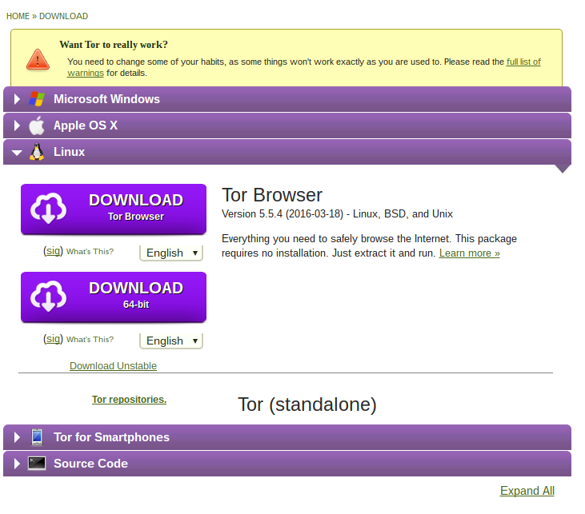
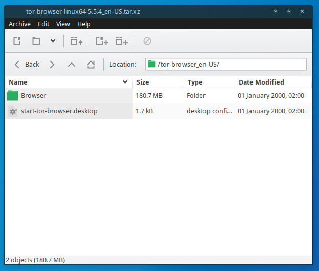
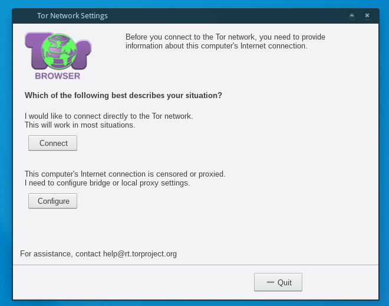
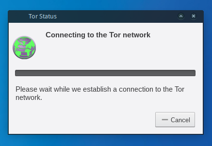
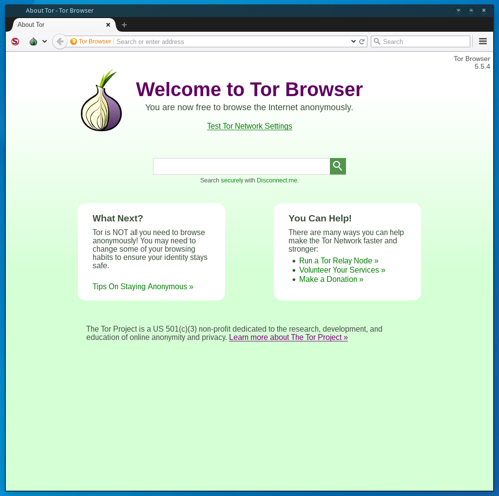

# kem gözlere şiş


### <https://www.kemgozleresis.org.tr>

#### Tor Browser

----

# Tor Nedir ?

Tor, “The Onion Routing” sözcüklerinin baş harflerinden oluşturulmuş, kullanıcılarına anonim iletişim imkânı sağlayan bir ağ ve yazılım projesinin adıdır. Proje dünya üzerinde konuşlanmış 6000'den fazla gönüllü Tor unsurunun (Tor relay) oluşturduğu ağ üzerinden Tor web tarayıcısı kullanılarak kullanıcıların gerçek kimliklerini gizleyerek şifreli bir şekilde internete erişmelerine imkân sağlamaktadır.

# Genel Kurulum

Resmi Web sitesi olan <https://www.torproject.org/download/download.html.en> Adresine girilir.Linux Sekmesine tıklanır ve Sisteminize göre 32 bit veya 64 bit indirilir.



Herhangi bir dosya yöneticisi ile dosyamızı çıkartma işlemine geçiyoruz.



Terminal aracılığı ile bu işlemi yapmak isterseniz.

```
tar -xvf tor-browser-linux*
```

Ardından karşınıza `Browser` adında bir klasör ve hemen yanında `Tor Browser Setup` adında çalıştırılabilir bir dosya çıkacak. `Tor Browser Setup` Çift tıklıyoruz ve açıyoruz.Ayarı otomatik olarak yapacağı için karşınıza bir şey çıkmayacak klasör içerisinde ikon değişecek ve artık `Tor Browser` kullanabileceksiniz.

Yeni gelen ikonu açtığınızda ise `Tor Network Settings` adı altında bir bölüm gelecek buradan detaylı bir şekilde ayarlama yapabileceğiniz gibi direk olarak bağlantı kurup da kullanabileceksiniz.



`Connect` Seçip devam ediyorum.



Bu işlem bittiğinde `Tor` karşınıza aşağıdaki gibi çıkacak ve artık güvenli bir şekilde anonimliğinizi koruyarak internette dolaşabilecek aynı zamanda sansür ve yaptırımlardan kurtulabileceksiniz.




# Gayri Resmi Kullanıcı Depoları

Kullanıcıların kurulum zorluklarının üstesinden kolaylıkla gelebilmeleri için geliştiriciler tarafından oluşturulmuş depolardır.

## Ubuntu PPA

```
sudo add-apt-repository ppa:webupd8team/tor-browser
sudo apt-get update
sudo apt-get install tor-browser
```

## Debian

```
apt-get install torbrowser-launcher
```

## Arch Linux

```
yaourt -S tor-browser-en
```
