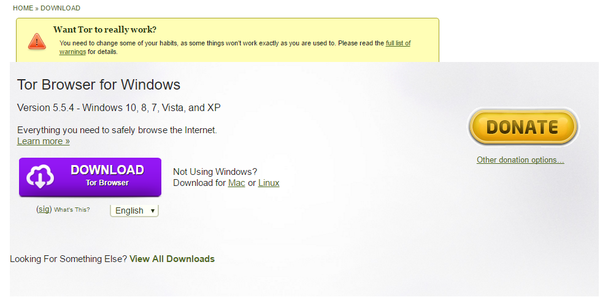
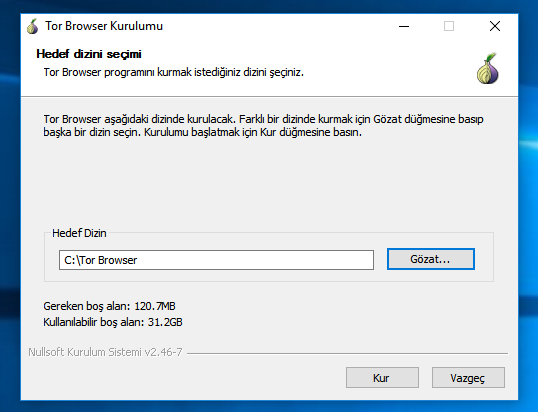
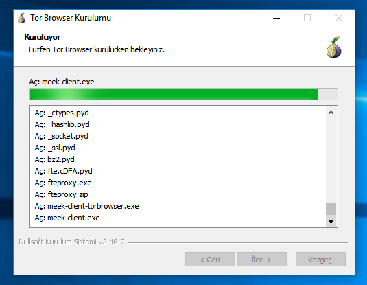
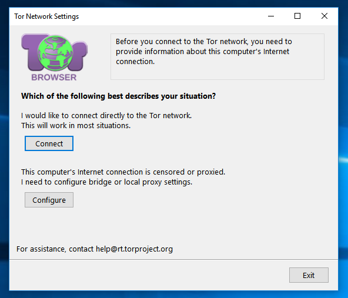
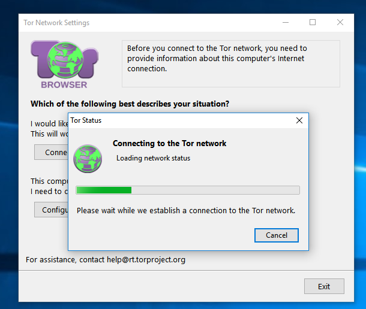
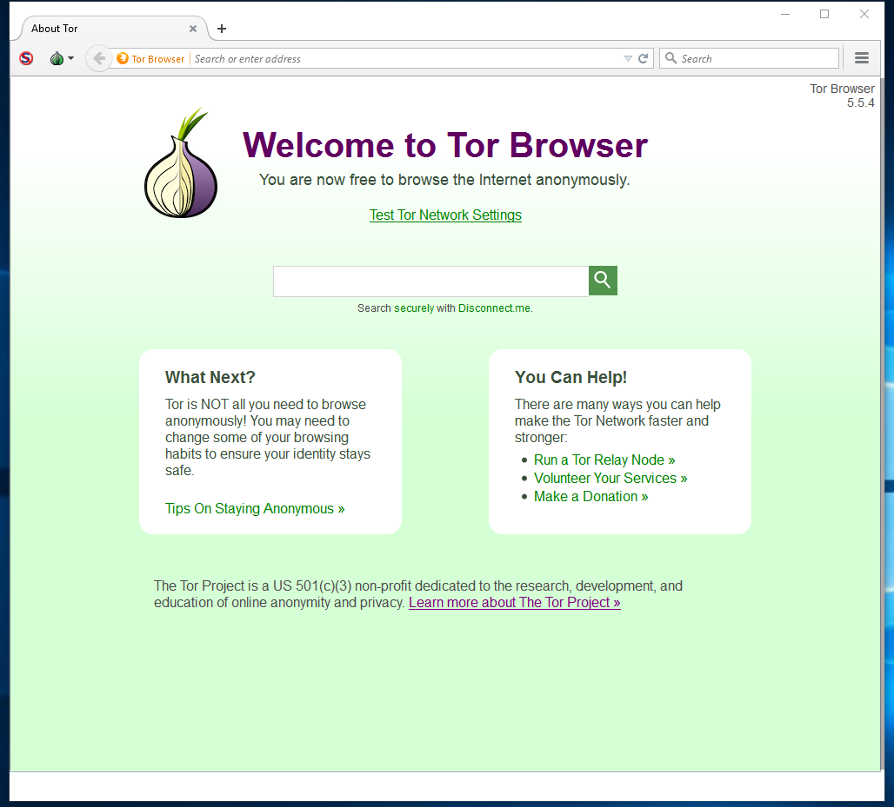

# kem gözlere şiş

### <https://www.kemgozleresis.org.tr>

#### Tor Browser

----

# Tor Nedir ?

Tor, “The Onion Routing” sözcüklerinin baş harflerinden oluşturulmuş, kullanıcılarına anonim iletişim imkânı sağlayan bir ağ ve yazılım projesinin adıdır. Proje dünya üzerinde konuşlanmış 6000'den fazla gönüllü Tor unsurunun (Tor relay) oluşturduğu ağ üzerinden Tor web tarayıcısı kullanılarak kullanıcıların gerçek kimliklerini gizleyerek şifreli bir şekilde internete erişmelerine imkân sağlamaktadır.

# Genel Kurulum

Gerekli olan kurulum dosyalarını <https://www.torproject.org/download/download.html.en> sitesinden gereken **Windows kurulum** dosyayı indiriyoruz.

İndirdiğimiz dosyayı `Yönetici olarak` çalıştırıyoruz.Karşımıza aşağıdaki gibi bir kurulum ekranı çıkacak

Kurulum yolu ön tanımlı olarak masaüstü ayarlıdır.Masaüstüne kurulum yapmasını istemiyorsanız kurulum yolunu benim gibi `C:\` yapabilirsiniz.

Kurulum sisteminizin özelliklerine göre yaklaşık _40 sn_ ile _1 dk_ arasında sürecektir.

Kurulum tamamlandıktan sonra masaüstüne `Tor Browser` adında bir ikon gelecek çift tıklayarak uygulamayı çalıştırıyoruz.

İlk olarak karşımıza `Tor Network Settings` çıkıyor.Buradan gereken ayarlamaları yapabiliriz veya direk olarak `Connect` butonu ile bağlanabiliriz.

Ön tanımlı olarak bir takım ayarlar yapılı olarak geldiği için `Connect` diyoruz ve devam ediyoruz.

`Tor Browser` Bağlanma işlemini sorunsuz bir şekilde tamamladı.`Tor` bu aşamadan sonra anonimliğinizi korumanıza yardımcı olacak aynı zamanda yapılan sansürlemelerden kurtulacaksınız.

**dipnot:** Kurulum Sanal Windows 10 üzerinde gerçekleştirilmiştir.
