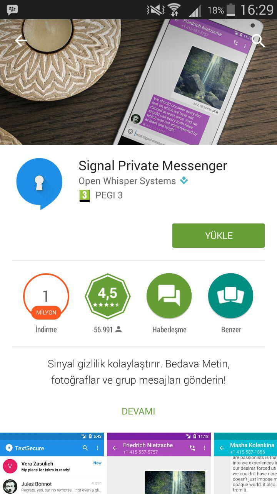
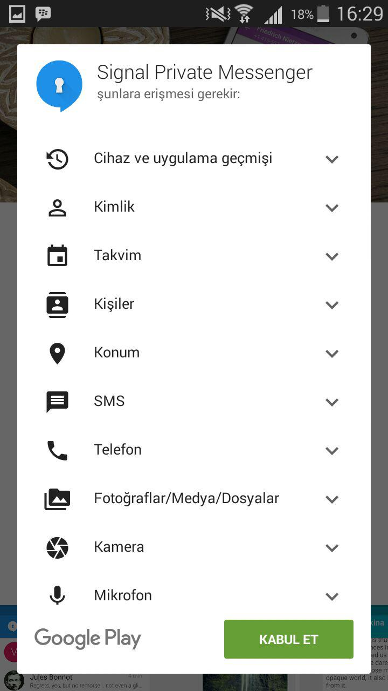
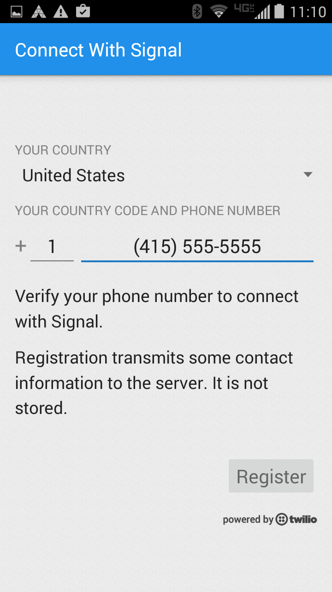
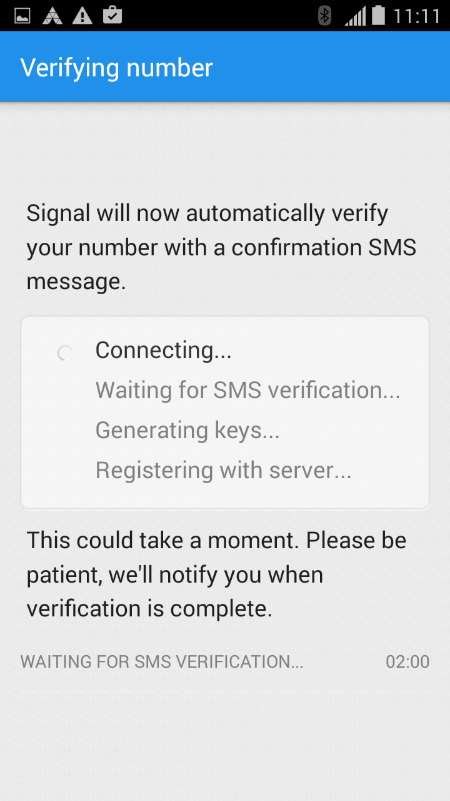
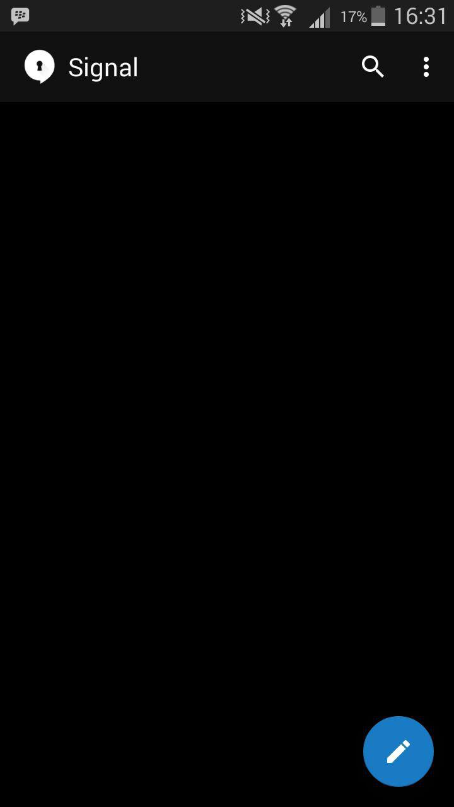
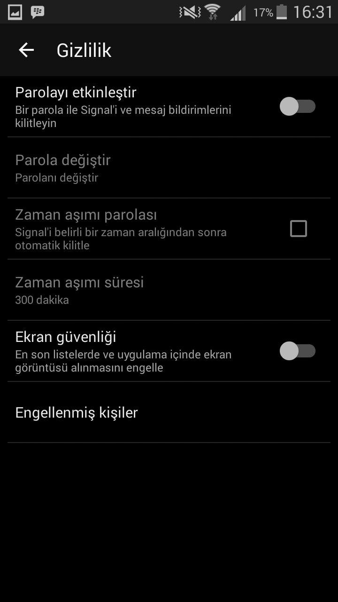

# kem gözlere şiş

## Signal Private Messenger

Signal uçtan uca şifreleme kullanarak Android kullanıcılarının Android ve iPhone kullanıcılarıyla şifreli bir şekilde mesajlaşmalarına, arama yapmalarına, fotoğraf ve video göndermelerine olanak sağlayan ücretsiz ve açık kaynak kodlu bir yazılım uygulamasıdır. Signal telefon numaralarını kişi listesi olarak kullanıyor olmasına rağmen, aramalar ve mesajlar veri bağlantınızı kullanır; bu yüzden konuşan iki taraf da mobil cihazlarıyla internete bağlı olmalıdır.  Bu yüzden Signal kullanıcıları SMS ve MMS ücretlerine maruz kalmazlar.

# Kurulum

Android cihazınız ile Google Play Store giriş yapın ve arama bölümüne Signal yazın veya [Signal Private Messenger](https://play.google.com/store/apps/details?id=org.thoughtcrime.securesms) bağlantısı ile `Yükle` diyoruz.

Signalin çalışması için gerekli olan izinlerin listelendiği bir ekran çıkacak karşınıza `Onayla` diyoruz ve devam ediyoruz.

Ardından uygulamayı açtığınızda kayıt ekranı göreceksiniz.(Ülkeden ülkeye farklılık gösterebilir.Temsilidir)

`Kayıt` butonuna bastığınız anda uygulama sizin telefonunuza 6 haneli bir kod gönderecek ve otomatik olarak aktivasyon işlemini gerçekleştirecektir.

Kurulumumuz tamamlanıyor ve uygulamamızı açıyoruz.

Uygulamada ek olarak gizlilik ayarlarını yapmanız sizin işinize oldukça yarayacaktır.Bu ayarlar içerisinde 2 adet hayati özellik bulunuyor bunlar ise;

* Parola: Mesajlarve bildirimlerin şifreniz dahilinde görüntülenmesi
* Ekran Güvenliği: Uygulama açıkken ekran görüntüsü alınmasının engellenmesi

Bunlar dışında opsiyonel olarak parolanın zaman aşımınıda ayarlayabilirsiniz.

